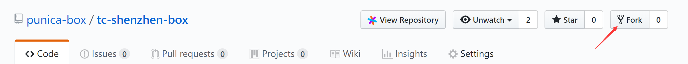
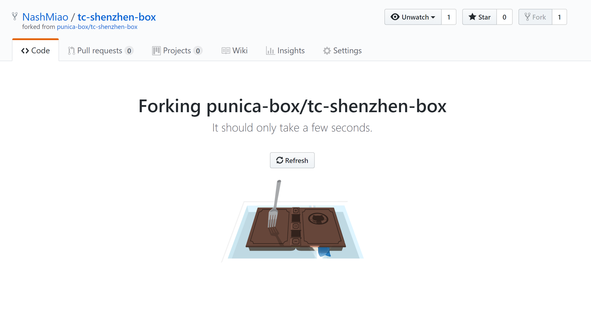
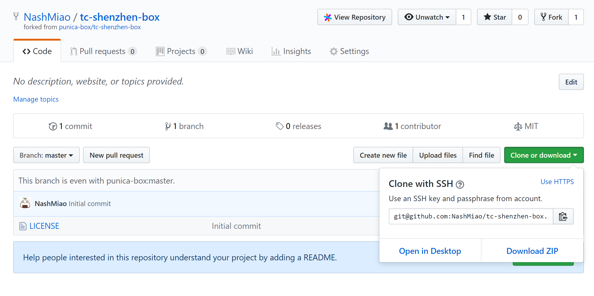
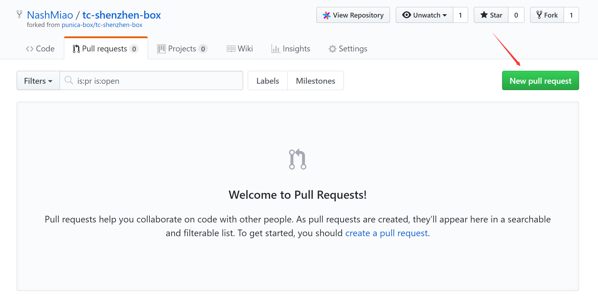

# tc-shenzhen-box

How can I submit my project in TC SHENZHEN Hackathon 2018?

Very easy!

- Fork this repository to your account.





- Clone the forked repository to your computer.



```bash
git clone git@github.com:NashMiao/tc-shenzhen-box.git
```

- Push source code to your forked repository.

```bash
git add .
git push
```

- Create a pull request.

